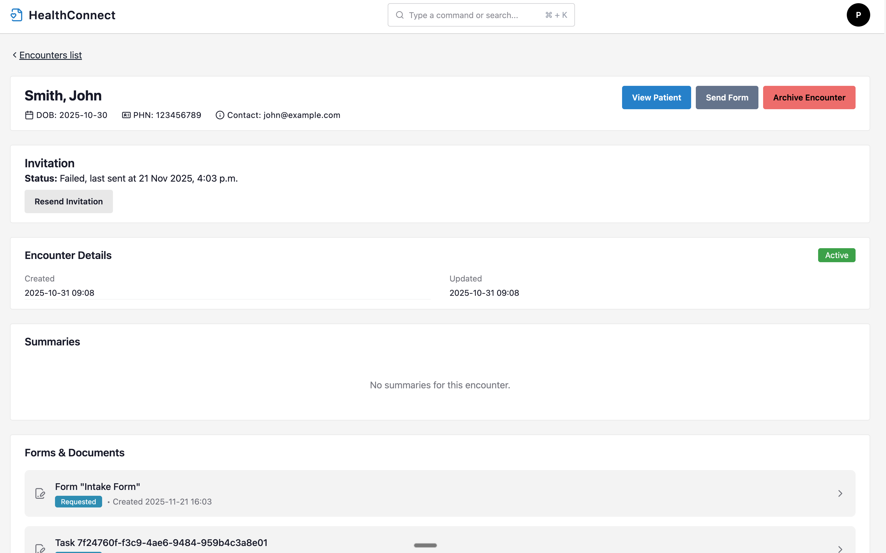
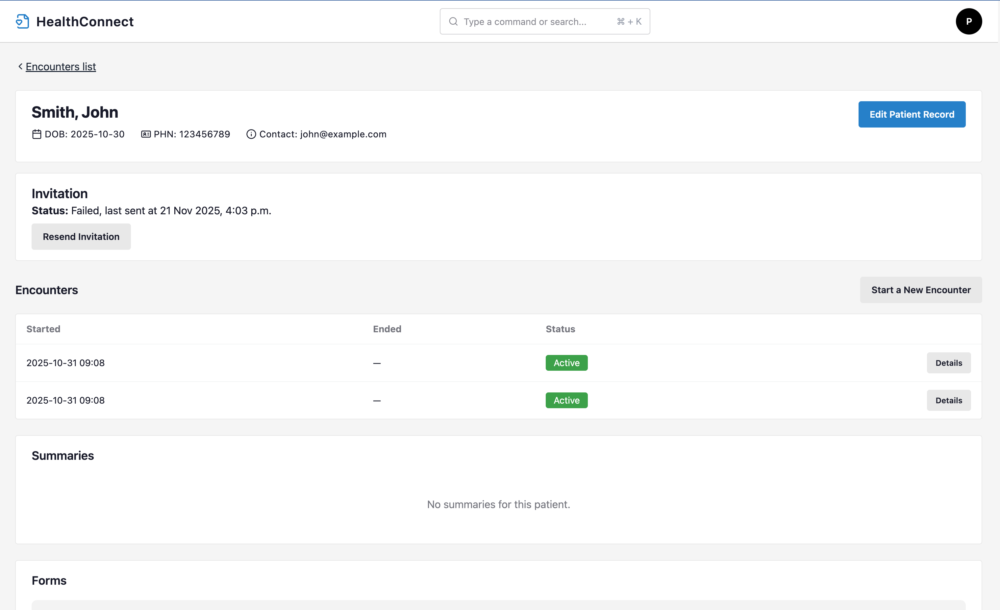
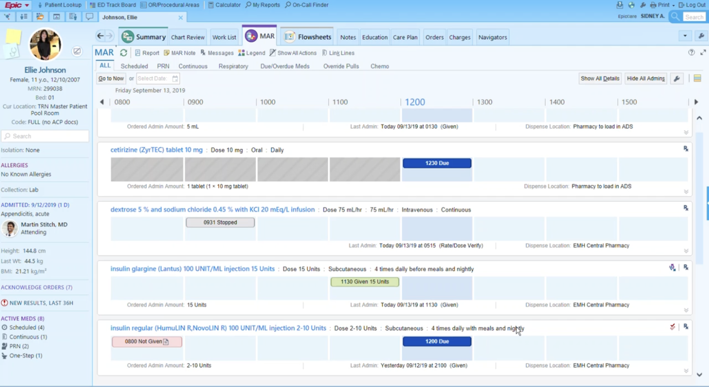
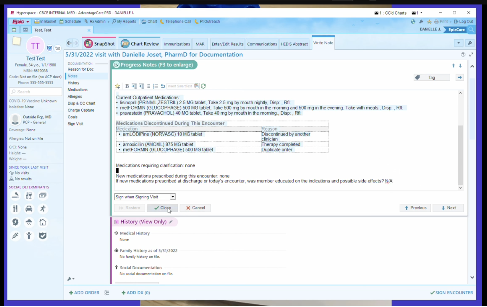
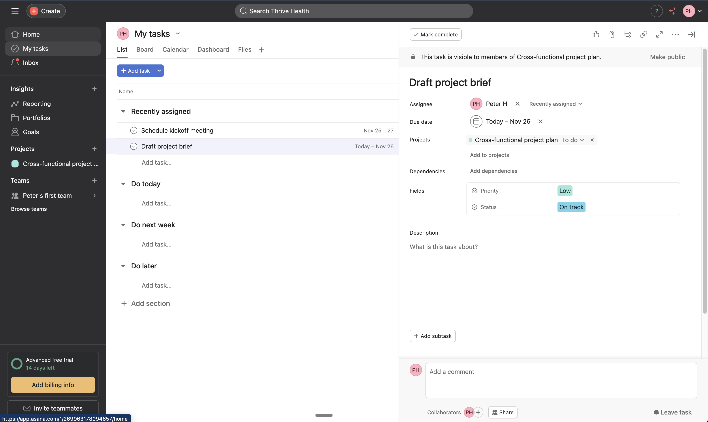
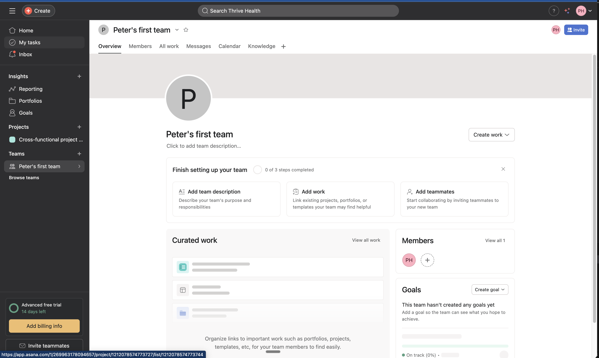
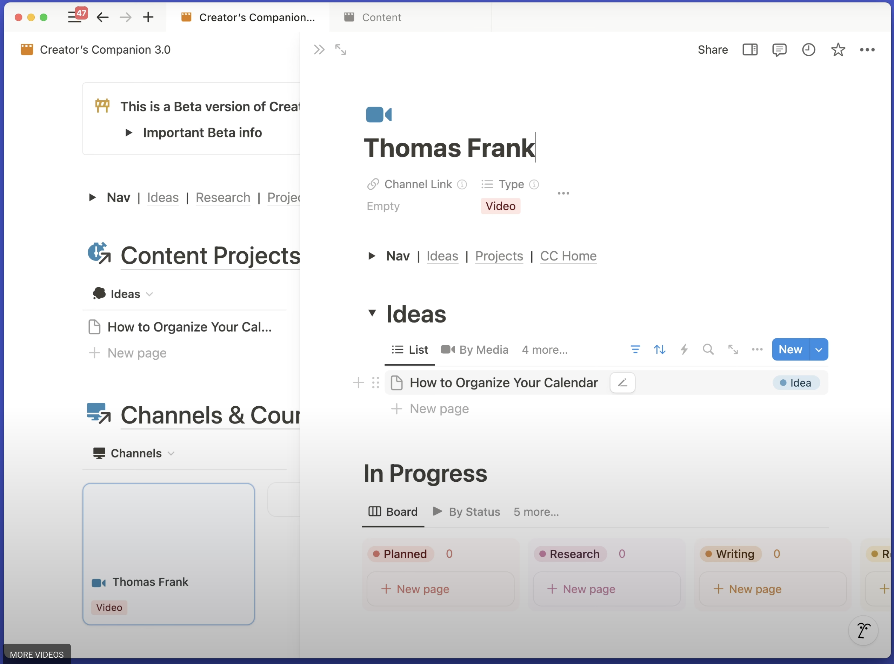
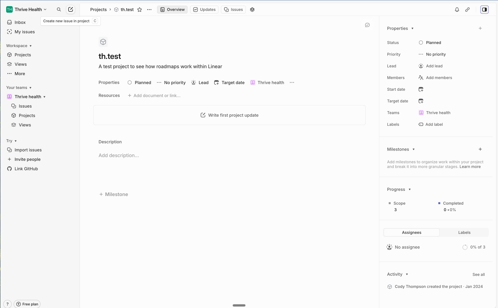

# PRD: Encounter Details Consolidation

**JIRA**: [HC-225](https://new-hippo.atlassian.net/browse/HC-225) &nbsp;|&nbsp; **Author**: [Peter Haralabous](https://home.atlassian.com/o/787759e2-0bbc-494d-b27d-26930e7600ab/people/618e9ea320c676007090a9c0?cloudId=c7306235-0180-4269-ae60-6513d0ef7dd6) &nbsp;|&nbsp; **Date**: Nov 24, 2025

---

## Problem Statement

Healthcare providers are confused by multiple similar views for encounter details and struggle to navigate between patient context and encounter information.

### Current State Issues

**Navigation Confusion**
- Two ways to view encounter details: separate "Encounter Details" page OR within "Patient Details"
- Unclear which path to take, creating decision fatigue
- Similar-looking pages create confusion about where users are in the application

**Context Loss**
- Viewing standalone encounter details loses patient context
- Providers need to reference patient info (demographics, history, other encounters) while reviewing a specific encounter
- Current design forces users to navigate back and forth between views

**Mental Model Mismatch**
- Providers think: "Patient with encounters" (hierarchical)
- Current design suggests: "Encounters as separate from patients" (flat)
- Workflow naturally flows from worklist → patient → encounter details, not worklist → standalone encounter

**Visual Examples**: See Figures A-B in [Appendix](#appendix) for images of our current state.

### Impact
- **Who**: Healthcare providers, clinical staff
- **Frequency**: Multiple times per patient encounter (high-frequency workflow)
- **Current Workaround**: Manual navigation between pages, losing context and efficiency

---

## Competitive Analysis

How do other healthcare systems solve multi-context navigation problems?

### Epic EMR: Tabs Within Patient Chart
**Pattern**: All encounter information lives as tabs within the patient chart[1][2]
- Patient context always visible
- Chart Review tabs (Labs, Encounters, Medications) keep users in patient scope
- Encounters are filtered/sorted within patient chart, not separate pages

**Key Insight**: Never separate encounters from patient context

**Visual Example**: See Figures 1-2 in [Appendix](#isual-examples) for Epic EMR screenshots showing patient context with tabbed navigation (Summary, Chart Review, MAR, etc.) and encounter details within patient chart.

### Master-Detail Pattern (Industry Standard)
**Pattern**: Parent view (master) maintains connection to child view (detail)[3][4][5][6]
- **Split View**: Side-by-side panels (common on desktop)
- **Drill-down**: New page but with clear breadcrumb back (mobile)
- **Tabs**: Details embedded as tabs within parent
- **Slide-out**: Overlay panel maintains visual connection to master

**Key Insight**: Multiple implementation options depending on content complexity and device

### Drawer/Side Panel Pattern (Modern Web Apps)
**Used by**: Asana, Notion, Linear

**When**: Showing detailed information without losing master list context
- User can interact with both master list and detail panel
- Good for sequential review (next/prev navigation)
- Inline editing without full-page navigation

**Key Insight**: Works well when users need to review multiple items sequentially while keeping list visible

**Visual Examples**: See Figures 3-6 in [Appendix](#visual-examples) for examples from Asana, Notion, and Linear showing side panel implementations.

### Research Findings
- **EHR Navigation Studies**: Providers navigate screens in highly variable patterns; reducing context switching improves efficiency[7][8][10]
- **Multi-EMR Research**: Integrated views showing data from multiple sources within primary context improve workflow and reduce safety risks[9]
- **Progressive Disclosure**: Healthcare apps manage complexity by showing essentials first, details on demand

### Summary Table

| Pattern | Maintains Context | Screen Space | Complexity | Mobile-Friendly |
|---------|------------------|--------------|------------|-----------------|
| Tabs Within Parent | ✓ High | Efficient | Low | ✓ Yes |
| Split View | ✓ High | Needs more | Medium | Partial |
| Slide-out Panel | ✓ Medium | Efficient | Low | ✓ Yes |
| Separate Page | ✗ Low | Maximum | Medium | ✓ Yes |

---

## User Interview Insights

Provider interviews (July-October 2025) validated the core problem and surfaced related pain points around information fragmentation and navigation efficiency.

### Information Consolidation as Critical Need

Providers consistently identified scattered information as a fundamental problem affecting clinical decision-making and efficiency.

> "I feel like the optimal area to start with is just like helping people get it all in one place. That's it. Like because we don't do it well now." (JB, Exercise Physiologist)

> "this is one of the biggest bug bears in medicine is um uh access to information, efficient use of medical information, communicating uh it's where a lot of mistakes happen." (MB, Family Physician)

**Implication**: The encounter details consolidation directly addresses this need by eliminating duplicate views and bringing encounter information into patient context.

&nbsp;
### Navigation Efficiency & Minimal Interaction Cost

Providers expressed strong preference for information being immediately visible without requiring multiple clicks or navigation steps.

> "I think that to to make things intuitive is to to use eye movement and what I can actually gather in terms of data as much as possible without using other things... if it's given to me before I click on a tab I appreciate it because I'm not so that saves me one click" (AA, Primary Care Physician)

**Implication**: Solution should minimize clicks and screen transitions. Favors embedded approaches (tabs, drawers) over patterns requiring navigation between separate pages.

&nbsp;
### Context Retention Requirements

Providers need to verify information and maintain awareness of broader patient context while reviewing specific details.

> "clinicians will really really want that or they'll want to know like yeah was this self-reported on an intake Q&A or was this like from a referral letter" (JB, Exercise Physiologist)

**Implication**: Whichever solution is chosen must maintain visible patient context (name, MRN, demographics) while viewing encounter details. Supports Solutions 1-4 over Solution 5 (full-page navigation).

&nbsp;

### Fragmented Systems Create "Chart Archaeology"

Providers described significant time spent navigating between multiple systems and views to gather patient information before making clinical decisions.

> "Pre-prescribed, I probably spent sometimes 10 to 15 minutes for a complex case. If it's here in the hospital, it can be as long as half an hour sometimes—clicking on Cerner and clicking on Care Connect, opening, closing, opening, closing." (P4, Internal Medicine)

> "I just don't know if it would be worth an implementation process for cost, and now there's another portal to be a part of, there's another place to look for information." (P16, Allied Health)

**Implication**: Solutions that consolidate information within existing workflows (rather than adding new places to look) will have higher adoption. The encounter consolidation must reduce, not add to, the number of places providers need to check.

&nbsp;

### Key Takeaway

Provider interviews confirm that **information consolidation and navigation efficiency are high-priority problems** worth solving. Key findings:

1. **Scattered information is a critical pain point** affecting clinical decision-making and causing providers to spend significant time on "chart archaeology"
2. **Navigation efficiency matters** - every click counts, and information should be immediately visible without excessive navigation
3. **Context must be maintained** - providers need patient context visible while viewing encounter details to avoid errors and maintain situational awareness
4. **Don't add another place to look** - solutions must consolidate within existing workflows, not create additional portals or systems

The specific navigation pattern (tabs vs drawer vs split view) should be validated through prototype testing, but all solutions should prioritize keeping patient context visible and minimizing navigation clicks.

&nbsp;
---

## Solution Proposals

We'll prototype and test 5 different approaches to solve the navigation and context problem:

### Solutions at a Glance

1. **Embedded Tabs (Epic Pattern)** - Encounter details become a tab within Patient Details page
2. **Right-Side Drawer (Modern App Pattern)** - Encounter details slide in from right side, overlaying part of patient view
3. **Split View (Desktop Master-Detail)** - Side-by-side layout with patient on left, encounter on right
4. **Enhanced Slideout with Patient Context** - Improve existing slideout by embedding more patient context
5. **Drill-Down with Sticky Patient Header** - Navigate to encounter as separate view, but keep patient context visible

&nbsp;
---

### Solution 1: Embedded Tabs (Epic Pattern)

**Concept**: Encounter details become a tab within Patient Details page

**How it works**:
- Click "View Patient" from worklist → opens Patient Details with encounter tab active
- Tab navigation: Overview | Encounters | Forms | Documents | **[Encounter: Date]**
- Patient header stays visible while viewing encounter tab
- Close tab (X) returns to overview

**Pros**:
- Matches Epic's proven pattern
- Patient context always visible
- Clean, organized UI
- Familiar tab interaction

**Cons**:
- Tab bar could get cluttered with multiple artifacts open
- Less space for encounter content than full page

**Best for**: Users who frequently switch between patient info and encounter details

&nbsp;
---

### Solution 2: Right-Side Drawer (Modern App Pattern)

**Concept**: Encounter details slide in from right side, overlaying part of patient view

**How it works**:
- Click "View Patient" → shows Patient Details page
- Encounter automatically opens in right drawer (400-500px wide)
- Patient overview visible in background (partially)
- Drawer has tabs for organizing encounter content
- Close drawer to see full patient view

**Pros**:
- Maintains visual connection to patient page
- More space for encounter content than tab
- Can interact with patient page while drawer open
- Modern, familiar pattern (Asana, Notion, Linear)

**Cons**:
- Partially obscures patient content
- May feel cramped on smaller screens

**Best for**: Users who need to reference patient info while reading encounter details

&nbsp;
---

### Solution 3: Split View (Desktop Master-Detail)

**Concept**: Side-by-side layout with patient on left, encounter on right

**How it works**:
- Click "View Patient" → shows split screen
- Left panel (40%): Patient overview, encounter list, other artifacts
- Right panel (60%): Full encounter details
- Can resize panels by dragging divider
- Click different encounter in left list to update right panel

**Pros**:
- Both views always visible
- Easy to compare encounters or reference patient info
- Maximum information density
- Good for desktop workflows

**Cons**:
- Requires wider screen (not mobile-friendly)
- Less space for each view
- More complex layout

**Best for**: Desktop users who need simultaneous access to both views

---

### Solution 4: Enhanced Slideout with Patient Context

**Concept**: Improve existing slideout by embedding more patient context

**How it works**:
- Keep current slideout for quick preview
- Add "Open in Patient Context" button in slideout
- Opens larger slideout (70% screen width) with:
  - Encounter details (main content)
  - Patient summary card (top or side)
  - Quick links to related patient artifacts
- Background slightly dimmed/blurred

**Pros**:
- Minimal change from current behavior
- Progressive disclosure (quick preview → detailed view)
- Maintains slideout muscle memory

**Cons**:
- Still somewhat modal/overlay nature
- Large slideout may feel overwhelming
- Not a complete solution to standalone page problem

**Best for**: Users who like current slideout but need patient context

&nbsp;
---

### Solution 5: Drill-Down with Sticky Patient Header

**Concept**: Navigate to encounter as separate view, but keep patient context visible

**How it works**:
- Click "View Patient" → opens Patient Details
- Click encounter from list → navigates to encounter details view
- Sticky patient header at top (collapsible)
- Clear breadcrumb: Worklist > Patient: [Name] > Encounter: [Date]
- "Back to Patient" button returns to overview

**Pros**:
- Maximum space for encounter content
- Patient identity always visible
- Clear navigation hierarchy
- Simplest to implement (similar to current)

**Cons**:
- Still feels like separate page
- Requires navigation clicks between patient and encounter info
- Doesn't fully solve context switching problem

**Best for**: Users who prefer full-page views but need patient context reminder

&nbsp;
---

## Prototype Testing Plan

### Test Goals
- **Primary**: Which solution helps users maintain patient context while reviewing encounters?
- **Secondary**: Which solution feels most intuitive for the worklist → patient → encounter workflow?

### Success Metrics

**Efficiency**:
- Time to complete task: "Review encounter and verify patient allergies"
- Number of navigation clicks/actions
- Time spent in wrong view/lost

**Context Retention**:
- Can users recall patient name while viewing encounter? (memory test)
- Can users locate patient info while viewing encounter? (observation)

**Usability**:
- Task completion rate
- Error rate (getting lost, confusion)
- Post-task confidence rating (1-5 scale)

**Preference**:
- Which solution would you choose for daily work?
- Net Promoter Score (likelihood to recommend)
- Perceived ease of use (SUS - System Usability Scale)

### Testing Approach
- **Method**: Moderated usability testing with interactive prototypes
- **Participants**: 3-5 healthcare providers (mix of experience levels)
- **Tasks**:
  1. Start from worklist, find encounter, review details
  2. While viewing encounter, answer question about patient (requires context)
  3. Navigate between multiple encounters for same patient
  4. Return to worklist
- **Data Collection**: Time-on-task, click tracking, think-aloud protocol, post-task survey

&nbsp;
---

## Next Steps
1. **Design Prototypes** - Create interactive prototypes for each solution proposal
2. **User Interviews** - Gather insights on current pain points and workflow patterns
3. **Usability Testing** - Test prototypes with 3-5 providers
4. **Analysis** - Synthesize findings and recommend solution
5. **Detailed Requirements** - Create specs for chosen solution
6. **Implementation** - Phased rollout

&nbsp;
---

## Appendix

### Key User Workflows (Current State)

**Workflow A: Worklist → Encounter Slideout**
1. Click encounter row → slideout opens
2. Review quick details
3. Click "View Patient" → loses slideout context

**Figure A: Current State: Encounter Details**

**Figure B: Current State: Patient Details**

**Workflow B: Worklist → Patient Details**
1. Click kebab → "Patient Details"
2. Opens patient page
3. Must navigate to find encounter info

**Workflow C: Worklist → Standalone Encounter Details** *(problematic)*
1. Some path leads to standalone encounter page
2. No patient context visible
3. Confusion about where you are

### Visual Examples

**Figure 1: Epic EMR - Patient Chart with MAR Tab**

This screenshot demonstrates Epic's tabbed approach within the patient chart. Key observations:
- Patient context (Ellie Johnson, demographics, allergies) always visible in left sidebar
- Top navigation tabs: Summary, Chart Review, Work List, MAR, Flowsheets, Notes, etc.
- Current view shows MAR (Medication Administration Record) without losing patient context
- User can switch between different data views (medications, encounters, labs) via tabs while maintaining awareness of which patient they're viewing

**Figure 2: Epic EMR - Encounter Details Within Patient Chart**

This screenshot shows how Epic displays encounter details while maintaining patient context:
- Patient information (Test Test, demographics) remains in left sidebar
- Encounter-specific information shown in main content area: date "5/31/2022 visit with Danielle Joset, PharmD"
- Tabs within encounter: SnapShot, Chart Review, Immunizations, MAR, Communications, etc.
- Progress Notes displayed as primary content with encounter documentation
- Patient's medical history, medications, and social determinants visible in sidebar

**Key Pattern**: Both examples show how Epic never separates encounter details from patient context. Whether viewing medications, encounters, or documentation, the patient sidebar remains consistently visible, preventing users from losing context about which patient they're working with.

---

**Figure 3: Asana - Side Panel Detail View**

Asana's implementation of the side panel pattern for task details:
- Task list remains visible on the left (master view)
- Task details slide in from the right (detail panel)
- Users can click through multiple tasks without losing context of the project/list
- Panel can be closed to return to full list view

**Figure 4: Asana - Tab View Within Panel**

Asana organizes task details using tabs within the side panel:
- Main task information in default view
- Additional tabs for subtasks, attachments, comments
- Tabs keep the panel organized while providing access to comprehensive information
- Pattern combines tabs + side panel for maximum organization

**Figure 5: Notion - Side Panel for Page Details**

Notion's side panel pattern for viewing page details:
- Main workspace remains visible in background
- Page details open in right panel
- Users can reference multiple pages simultaneously
- Maintains context while drilling into specific content

**Figure 6: Linear - Collapsible Side Panel**

Linear's collapsible side panel for issue details:
- Issue list visible on left
- Issue details in expandable right panel
- Panel can be resized or collapsed as needed
- Supports rapid issue triage while maintaining list context

**Key Pattern Across Modern Apps**: All examples show detail panels that:
1. Maintain visual connection to the master list
2. Allow interaction with both master and detail simultaneously
3. Support sequential navigation (next/prev) within the panel
4. Can be closed/collapsed to return to full master view

## References

**Internal Documents**

### Provider User Interviews - Codebook
- [Provider User Interviews - Codebook Document](https://docs.google.com/document/d/1svSyUI48qHtXXlLGqaLLJGelYn2v9ipRxpRAUhzYpWg/edit?usp=drive_link)

---

### Epic EMR Pattern
1. University of Iowa Epic Education - Chart Review: [https://epicsupport.sites.uiowa.edu/epic-resources/chart-review](https://epicsupport.sites.uiowa.edu/epic-resources/chart-review)
2. Johns Hopkins Medicine - Epic Tips and Tricks (2019): [https://www.hopkinsmedicine.org/news/articles/2019/08/epic-shortcuts-experts-share-their-favorite-tips](https://www.hopkinsmedicine.org/news/articles/2019/08/epic-shortcuts-experts-share-their-favorite-tips)

---

### Master-Detail UI Patterns
3. Oracle Alta UI - Master-Detail Pattern: [https://www.oracle.com/webfolder/ux/middleware/alta/patterns/MasterDetail.html](https://www.oracle.com/webfolder/ux/middleware/alta/patterns/MasterDetail.html)
4. Oracle Alta Mobile - Master Detail: [https://www.oracle.com/webfolder/ux/mobile/pattern/masterdetail.html](https://www.oracle.com/webfolder/ux/mobile/pattern/masterdetail.html)
5. Microsoft Windows Developer Blog - Master the Master-Detail Pattern (2017): [https://blogs.windows.com/windowsdeveloper/2017/05/01/master-master-detail-pattern/](https://blogs.windows.com/windowsdeveloper/2017/05/01/master-master-detail-pattern/)
6. Web App Huddle - Master-Detail UI Pattern Design (2019): [https://webapphuddle.com/master-detail-ui-pattern-design/](https://webapphuddle.com/master-detail-ui-pattern-design/)

---

### EHR Navigation Research
7. Coleman et al. - Analysing EHR navigation patterns and digital workflows among physicians during ICU pre-rounds: [https://pmc.ncbi.nlm.nih.gov/articles/PMC8435833/](https://pmc.ncbi.nlm.nih.gov/articles/PMC8435833/)
8. Usability Challenges in Electronic Health Records: Impact on Documentation Burden and Clinical Workflow (2025): [https://pmc.ncbi.nlm.nih.gov/articles/PMC12206486/](https://pmc.ncbi.nlm.nih.gov/articles/PMC12206486/)
9. Studying workflow and workarounds in EHR-supported work to improve health system performance: [https://pmc.ncbi.nlm.nih.gov/articles/PMC8061456/](https://pmc.ncbi.nlm.nih.gov/articles/PMC8061456/)
10. Melton et al. - Usability Testing of Two Ambulatory EHR Navigators (2016): [https://pmc.ncbi.nlm.nih.gov/articles/PMC4941856/](https://pmc.ncbi.nlm.nih.gov/articles/PMC4941856/)

---
